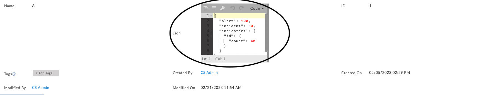

| [Home](../README.md) |
|--------------------------------------------|

# Usage

**Funnel Chart Widget Edit View**

**1. Module Type : Single Module**

Select the single module option if all the records to be rendered are in a single record of a certain field of the module.

1. Select the data source(module) to fetch the data from.
2. Use the 'Filter', to filter out the record that contains the data.  

3. Select the field (the field must be of type json.)
    *Below is an example of how the field could be.*

    

4. In the value section of the layer, mention the key for which the value is the data to be rendered. 
    eg. for the above json data, to reder Alert and Indicator's data populate the 'value' field as following
    

Note:: If the value of the given key is not a number, ie. it is either the key is invalid or the value isnt a number, then '0' will be displayed and on hover invalid data will be shown.

**2. Module Type : Across Modules**

"Across Modules" Module type lets you select the module and it displays the count of records for the module based on the filters given

**Widget For All 4 Layers**

**Note** : Maximum 4 layers can be added for any of the selected module types.