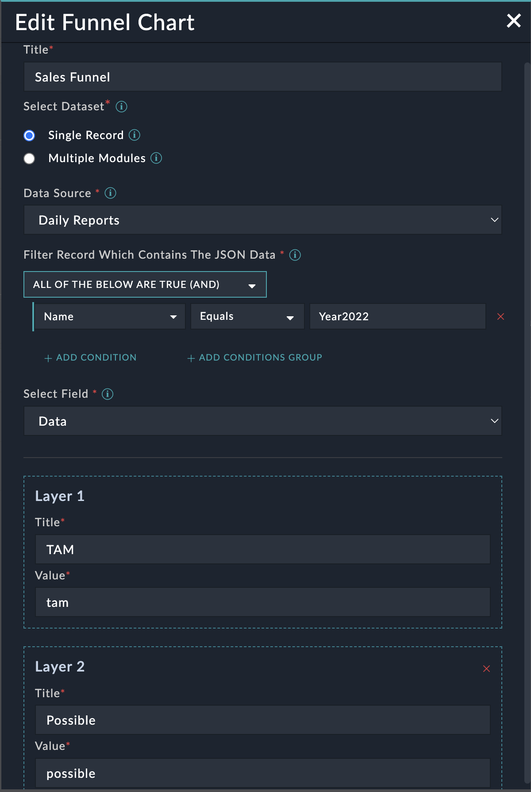
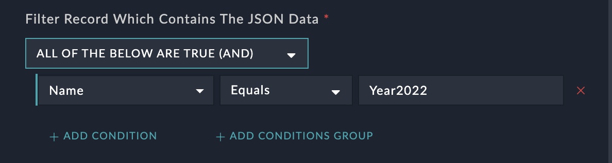
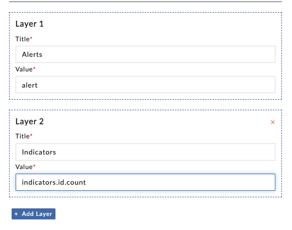
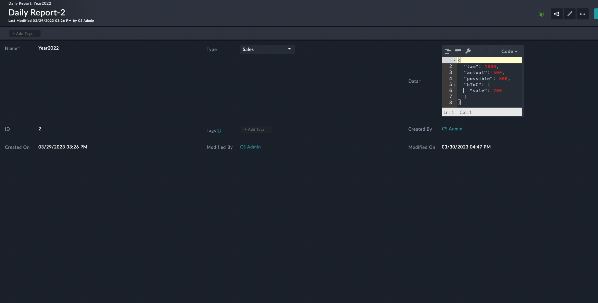
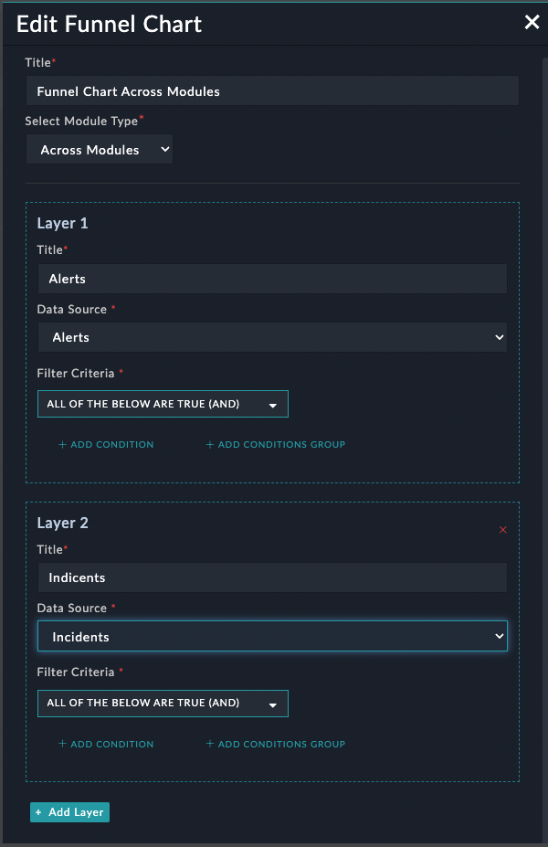
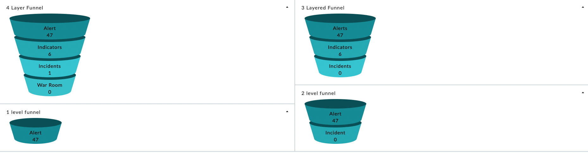

| [Home](../README.md) |
|--------------------------------------------|

# Usage

**Funnel Chart Widget Edit View**

**1. Dataset : Single Module**

Select the "Single Module" option if all the records to be rendered are in a single record of a certain field of the module.
<div style="width: 60%">



</div>

1. Select the data source(module) to fetch the data from.
2. Use the 'Filter', to filter out the record that contains the data.
    <div style="width: 60%">
    
    
    
    </div>

3. Select the field (the field must be of type json.)
    *Below is an example of how the field could be.*
    
    ```JSON 
    {
        "tam": 1000,
        "actual": 500,
        "possible": 800,
        "bToC": {
            "sale": 200
        }
    }
    ```
4. In the value section of the layer, mention the key for which the value is the data to be rendered. 
    eg. for the above json data, to reder actual and Sale's data populate the 'value' field as following
    <div style="width: 50%">

    
    
    </div>


**Example of a custom module**




**Widget**

This is how the data will be visible in the funnel
<div style="width: 50%;">
  

  
</div>


Note:  If the value of a given key is not numeric then by default '0' (In this case for incident) will be displayed and user will see an error "Invalid data" hover on .


**2. Dataset : Across Modules**

<div style="width: 60%;">



</div>
"Across Modules" Dataset lets you select the module and it displays the count of records for the module based on the filters given


**Widget**


<div style="width: 50%">
  

  
</div>


**Note** : Maximum 4 layers can be added for any of the selected Datasets.