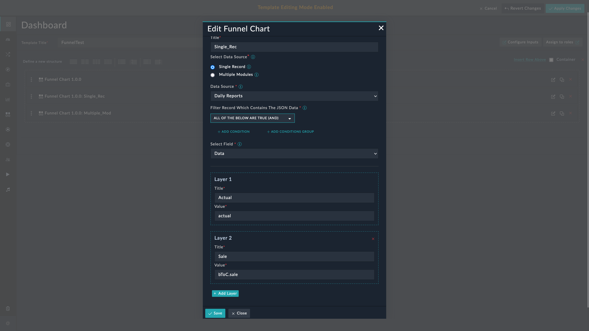
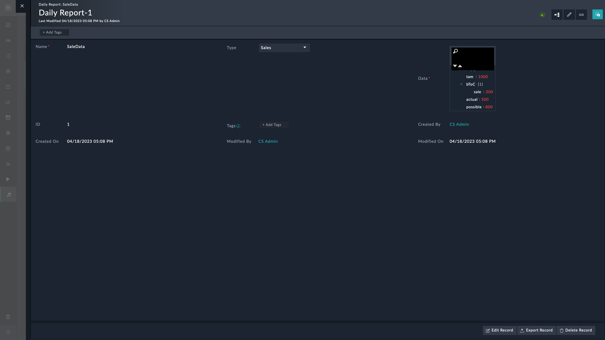
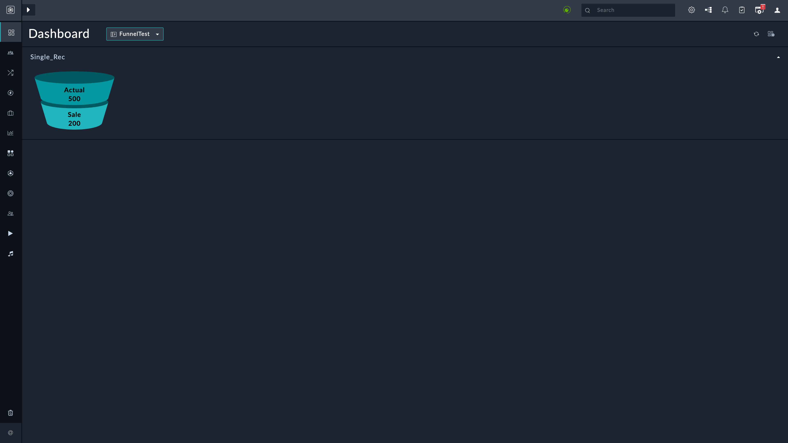
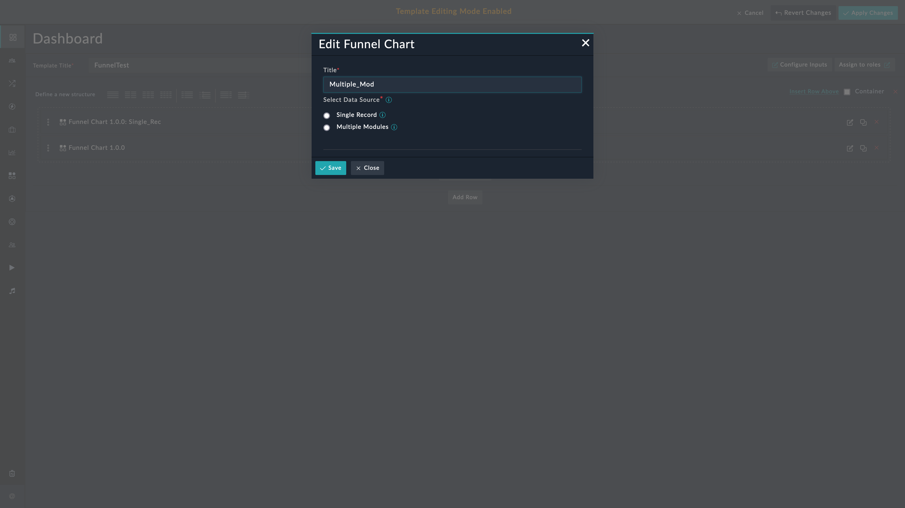
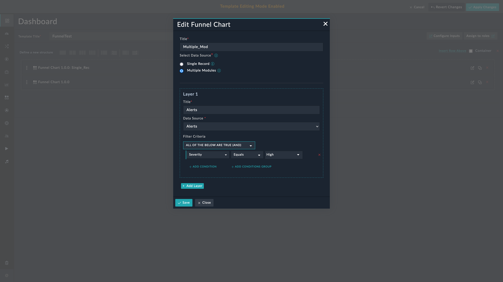
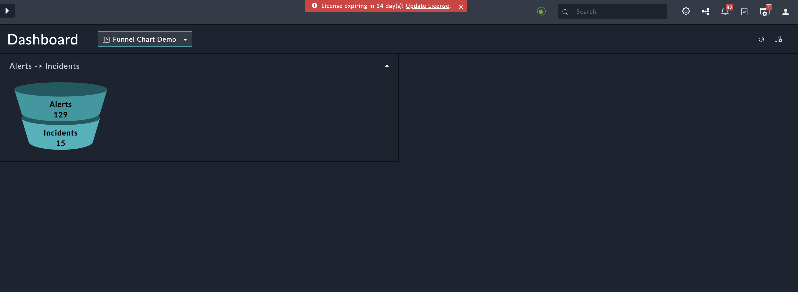

| [Home](../README.md) |
|--------------------------------------------|

# Usage

The funnel chart widget provides a graphical representation of the number of alerts or incidents at each stage of the process. This information can be used to optimize the incident response process and improve overall efficiency.

In addition to incident response, the funnel chart widget can be used in various other domains such as sales and marketing to track the progress of leads through the sales funnel, and other contexts, such as website analytics or customer service. The stages in a funnel chart widget can be customized to reflect the specific process being analyzed.

## Funnel Chart Widget Edit View

This section details the process to edit the widget and use it with data from a specific record or from across multiple modules.

### Single Record

This option helps retrieve and display data from a record that has values in `JSON` format. Select the **Single Record** option if all data to be rendered is in a specific field of the module. The widget has filters to select only that record that meets the filter conditions.

1. Edit a module's (e.g. *Dashboard*) view template and select **Add Widget** button.

2. Select **Funnel Chart** from the list to bring up the **Funnel Chart** widget's customization modal.

3. Specify the title of the funnel chart in the **Title** field.

    

4. Select **Single Record** in the *Data Source* field.

    

5. Select a module whose records contain `JSON` data. A message informs if the selected module does not contain data in `JSON` format.

    

6. Define filters under the field **Filter Record Which Contains The JSON Data**. The filter conditions should be such that they select only the record that contains the relevant data.

7. Select the field (the field must be of type `JSON`).

    *Below is an example of the field's value*:
    
    ```JSON 
    {
        "tam": 1000,
        "actual": 500,
        "possible": 800,
        "bToC": {
            "sale": 200
        }
    }
    ```
8. Specify a **Title** for the layer **Layer 1**.

9. Specify the `JSON` *key* whose *value* is to be rendered in the **Value** field.

    > Consider the `JSON` data mentioned in the example. To render `actual` and `sale` data in two layers, populate the **Value** field as follows:
    >
    >

10. Click the button **Add Layer** to add a new layer to Funnel Chart widget.

11. Specify the **Title** and **Value** as explained in previous steps.

**NOTE**: You can add a minimum of `1` and maximum of `4` layers to the Funnel Chart widget.

#### Example of a custom module

The following image shows a record containing `JSON` data:




#### Appearance

The following image shows how the data appears in the funnel chart after adding the single record containing `JSON` data.



> **NOTE**:  If the value of a given key is not numeric, by default `0` is displayed and On hover, the error **Invalid data** appears.


### Multiple Modules

This option helps retrieve and display data from records across multiple modules. Select the **Multiple Modules** option to show data across modules. The widget has filters to select only that record that meets the filter conditions.

1. Edit a module's (e.g. *Dashboard*) view template and select **Add Widget** button.

2. Select **Funnel Chart** from the list to bring up the **Funnel Chart** widget's customization modal.

3. Specify the title of the funnel chart in the **Title** field.

    

4. Select **Multiple Modules** in the **Data Source** field.

5. Specify a **Title** for the layer **Layer 1**.

6. Select a module (e.g. *Alert*) as the **Data Source**.

7. Add filter criteria to show only relevant data.

    

10. Click the button **Add Layer** to add a new layer to Funnel Chart widget.

11. Specify the **Title** and **Value** as explained in previous steps.

**NOTE**: You can add a minimum of `1` and maximum of `4` layers to the Funnel Chart widget.


#### Appearance

The following image shows how the data appears in the funnel chart after adding multiple modules as layers.



| [Installation](./setup.md#installation) | [Configuration](./setup.md#configuration) |
|----------------------------------------------|------------------------------------------------|
