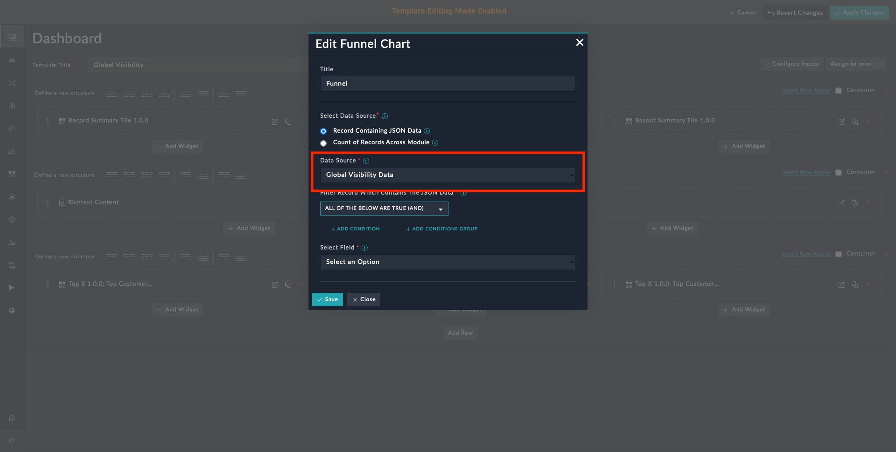

| [Home](../README.md) |
|----------------------|

# Usage

The funnel chart widget provides a graphical representation of the number of alerts or incidents at each stage of the process. This information can be used to optimize the incident response process and improve overall efficiency.

In addition to incident response, the funnel chart widget can be used in various other domains such as sales and marketing to track the progress of leads through the sales funnel, and other contexts, such as website analytics or customer service. The stages in a funnel chart widget can be customized to reflect the specific process being analyzed.

## Funnel Chart Widget Edit View

This section details the process to edit the widget and use it with data from a specific record or from across multiple modules.

1. Edit a *Dashboard*'s view template and select **Add Widget** button.

2. Select **Funnel Chart** from the list to bring up the **Funnel Chart** widget's customization modal.

3. Specify the title of the funnel chart in the **Title** field.

    

### Record containing JSON Data

This option helps retrieve and display data from a record that has values in `JSON` format. Select the **Record containing JSON Data** option if all data to be rendered is in a specific field of the module. The widget has filters to select only that record that meets the filter conditions.

1. Select **Record containing JSON Data** in the *Data Source* field.

    

2. Select a module whose records contain `JSON` data in the *Data Source* field. In the following screenshot, we have selected a custom module that we created. For details on editing and creating modules, refer to the *Module Editor* section of the FortiSOAR *Administration Guide*, [here](https://docs.fortinet.com/document/fortisoar/7.4.1/administration-guide/97786/application-editor#Module_Editor).

    

3. Define filters under the field **Filter Record Which Contains The JSON Data**. In the following screenshot we filter the record by **_Site Type_**. You can define any other filter condition.

    <table>
        <tr>
            <th>NOTE</th>
            <td>The filter conditions should be such that they select <strong><em>only</em></strong> the record that contains relevant JSON data.</td>
        </tr>
    </table>

    

4. Select the field, whose data is to be displayed, in the **Select Field** field. The drop-down lists **_only_** the fields of type `JSON`. In the following screenshot, we have selected a field within the custom module that we created. For details on editing and creating fields, refer to the *Module Editor* section of the FortiSOAR *Administration Guide*, [here](https://docs.fortinet.com/document/fortisoar/7.4.1/administration-guide/97786/application-editor#Module_Editor).

    

5. Specify a **Title** for the layer **Layer 1**.

6. Specify the JSON `key` whose `value` is to be rendered in the **Value** field. In the following screenshot, we have selected a key in the JSON data content of the custom module that we created. The example block contains the sample data that we used.

    As is evident from the following screenshot, we use object notation to render each `key`'s value.

    

    <table>
        <thead>
            <th>Example</th>
        </thead>
        <tbody>
            <td>Consider the following JSON data in one of the record's JSON field:
                <pre>"funnelChart": {
                    "alerts": 27126,
                    "events": 62110,
                    "warrooms": 16,
                    "incidents": 4253
                    }</pre>
                
The following screenshot shows the Funnel Widget in action with this JSON data.

                

            </td>
        </tbody>
    </table>

7. Click the button **Add Layer** to add a new layer to Funnel Chart widget.

8. Specify the **Title** and **Value** as explained in previous steps.

<table>
    <tr>
        <th>NOTE</th>
        <td>You can add a minimum of <code>1</code> and maximum of <code>4</code> layers to the Funnel Chart widget.</td>
    </tr>
</table>

#### Advanced Settings

Under **Record containing JSON Data** > **Advanced Settings**, this widget can be configured to listen to events *broadcasted by another widget in the same dashboard*. An example of a broadcasting widget is the **Record Summary Card** widget.

In the following screenshot, we have selected the event name being broadcasted by the *Record Summary Card* widget.

Make a note of the event name being broadcasted by the widget. Use the exact event name when configuring *Funnel Chart*'s event listener.

<table>
    <tr>
        <th>IMPORTANT</th>
        <td>The event listening is triggered when you click a <em>Record Summary Card</em>. The <em>Funnel Chart</em> widget looks for compatible JSON data in the same record that contains data for the <em>Record Summary Card</em> widget. The <em>Funnel Chart</em> widget must be appropriately configured to use data from that record for the event listening to work as intended.</td>
    </tr>
</table>

___
The *Record Summary Card* widget can render and broadcast multiple JSON keys as cards. With the selection of a card the broadcasted event changes. Event listener widgets, such as *Funnel Chart*, can listen to these events and render the JSON data broadcasted by the selected card. This is helpful when managing multiple sites with varied data. Clicking a site card can generate targeted data for that site.

Following image is a side-by-side comparison of how selecting a different card, updates the associated data:

|  |  |  |
|:-------------------------------------------------------|:-------------------------------------------------------|:-------------------------------------------------------|
| Selected card *Australia*                              | Selected card *India*                                  | Selected card *Ireland*                                |
___

Under **Advanced Settings**, this widget can be configured to listen to events and dynamically load data broadcasted by another widget in the **_same dashboard_**. An example of a broadcasting widget is *Record Summary Card* widget.

Make a note of the event name being broadcasted by the widget. Use the exact event name when configuring *Funnel Chart*'s event listener.

<table>
    <tr>
        <th>IMPORTANT</th><td>The event listening is triggered when you click a <em>Record Summary Card</em>. The <em>Funnel Chart</em> widget looks for compatible JSON data in the same record that contains data for the <em>Record Summary Card</em> widget. The <em>Funnel Chart</em> widget must be appropriately configured to use data from that record for the event listening to work as intended.</td>
    </tr>
</table>

<table>
    <tr>
        <th>NOTE</th>
        <td>If the value of a given key is not numeric, by default <code>0</code> is displayed and on hover, the error <strong>Invalid data</strong> appears.</td>
    </tr>
</table>

### Count of Records Across Modules

This option helps retrieve and display data from records across multiple modules. Select the **Count of Records Across Module** option to show data across modules. The widget has filters to select only that record that meets the filter conditions.

1. Select **Count of Records Across Module** in the **Data Source** field.

2. Specify a **Title** for the layer **Layer 1**.

3. Select a module (e.g. *Alert*) as the **Data Source**.

4. Add filter criteria to show only relevant data.

5. Click the button **Add Layer** to add a new layer to Funnel Chart widget.

5. Specify the **Title** and **Value** as explained in previous steps.

<table>
    <tr>
        <th>NOTE</th>
        <td>You can add a minimum of <code>1</code> and maximum of <code>4</code> layers to the Funnel Chart widget.</td>
    </tr>
</table>

Following is an example configuration of the widget:

This configuration gives the following output, depending on the alerts, incidents, and other information on your FortiSOAR&trade; instance:

| [Installation](./setup.md#installation) | [Configuration](./setup.md#configuration) |
|-----------------------------------------|-------------------------------------------|