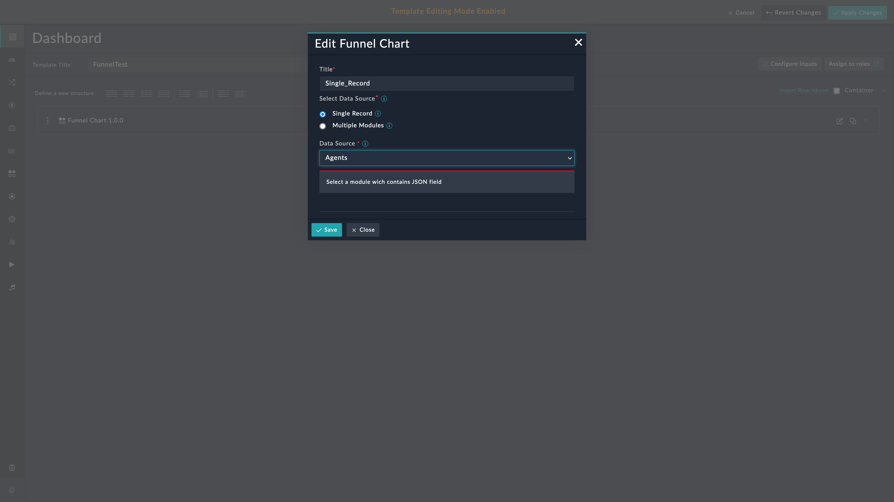

| [Home](../README.md) |
|---------------------------------------------|

# Usage

The funnel chart widget provides a graphical representation of the number of alerts or incidents at each stage of the process. This information can be used to optimize the incident response process and improve overall efficiency.

In addition to incident response, the funnel chart widget can be used in various other domains such as sales and marketing to track the progress of leads through the sales funnel, and other contexts, such as website analytics or customer service. The stages in a funnel chart widget can be customized to reflect the specific process being analyzed.

<<<<<<< HEAD
Select the "Record containing JSON Data" option if all the data to be rendered using JSON data of a certain field value of the module.
=======
## Funnel Chart Widget Edit View
>>>>>>> feb2808 (Image changes)

This section details the process to edit the widget and use it with data from a specific record or from across multiple modules.

### Record Containing JSON Data

This option helps retrieve and display data from a record that has values in `JSON` format. Select the **Record Containing JSON Data** option if all data to be rendered is in a specific field of the module. The widget has filters to select only that record that meets the filter conditions.

1. Edit a module's (e.g. *Dashboard*) view template and select **Add Widget** button.

2. Select **Funnel Chart** from the list to bring up the **Funnel Chart** widget's customization modal.

3. Specify the title of the funnel chart in the **Title** field.

    

4. Select **Record Containing JSON Data** in the *Data Source* field.

    

5. Select a module whose records contain `JSON` data. A message informs if the selected module does not contain data in `JSON` format.

    

6. Define filters under the field **Filter Record Which Contains The JSON Data**. The filter conditions should be such that they select only the record that contains the relevant data.

7. Select the field (the field must be of type `JSON`).

    *Below is an example of the field's value*:
    
    ```JSON 
    {
        "tam": 1000,
        "actual": 500,
        "possible": 800,
        "bToC": {
            "sale": 200
        }
    }
    ```
<<<<<<< HEAD
4. In the value section of the layer, mention the key for which the value is the data to be rendered. 
    eg. for the above json data, to render Actual and Sale's data populate the 'value' field as following
=======
8. Specify a **Title** for the layer **Layer 1**.
>>>>>>> feb2808 (Image changes)

9. Specify the `JSON` *key* whose *value* is to be rendered in the **Value** field.

    > Consider the `JSON` data mentioned in the example. To render `actual` and `sale` data in two layers, populate the **Value** field as follows:
    >
    >

10. Click the button **Add Layer** to add a new layer to Funnel Chart widget.

11. Specify the **Title** and **Value** as explained in previous steps.

**NOTE**: You can add a minimum of `1` and maximum of `4` layers to the Funnel Chart widget.

#### Example of a custom module

The following image shows a record containing `JSON` data:


#### Appearance

<<<<<<< HEAD
**Example of a Field and JSON Value**
=======
The following image shows how the data appears in the funnel chart after adding the single record containing `JSON` data.
>>>>>>> feb2808 (Image changes)


> **NOTE**:  If the value of a given key is not numeric, by default `0` is displayed and On hover, the error **Invalid data** appears.


### Count of Records Across Module

This option helps retrieve and display data from records across multiple modules. Select the **Count of Records Across Module** option to show data across modules. The widget has filters to select only that record that meets the filter conditions.

1. Edit a module's (e.g. *Dashboard*) view template and select **Add Widget** button.

2. Select **Funnel Chart** from the list to bring up the **Funnel Chart** widget's customization modal.

3. Specify the title of the funnel chart in the **Title** field.

    

4. Select **Count of Records Across Module** in the **Data Source** field.

5. Specify a **Title** for the layer **Layer 1**.

6. Select a module (e.g. *Alert*) as the **Data Source**.

7. Add filter criteria to show only relevant data.

    

10. Click the button **Add Layer** to add a new layer to Funnel Chart widget.

11. Specify the **Title** and **Value** as explained in previous steps.

**NOTE**: You can add a minimum of `1` and maximum of `4` layers to the Funnel Chart widget.


#### Appearance

<<<<<<< HEAD
Note:  If the value of a given key is not numeric then by default '?' will be displayed and user will see an error "Invalid data" hover on.
=======
The following image shows how the data appears in the funnel chart after adding Count of Records Across Module as layers.
>>>>>>> feb2808 (Image changes)


<<<<<<< HEAD
**2. Data Source : Count of Records Across Module**


"Count of Records Across Module" option lets you select the multiple modules and it displays the count of records for each module based on the applied filters.


**Note** : Maximum 4 layers can be added for any of the selected Datasets.
=======
| [Installation](./setup.md#installation) | [Configuration](./setup.md#configuration) |
|----------------------------------------------|------------------------------------------------|
>>>>>>> feb2808 (Image changes)
